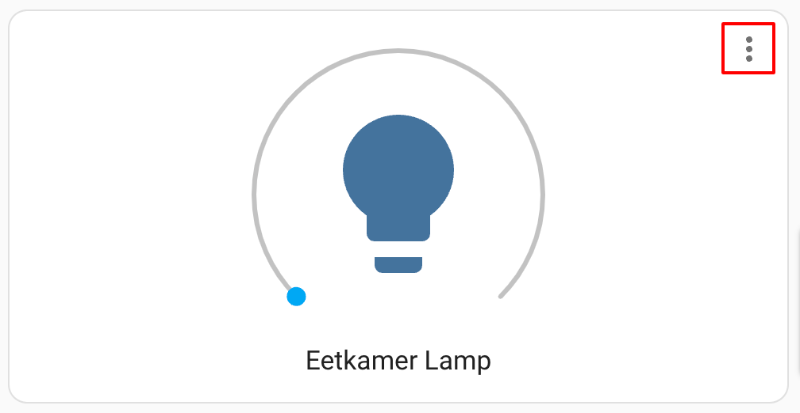
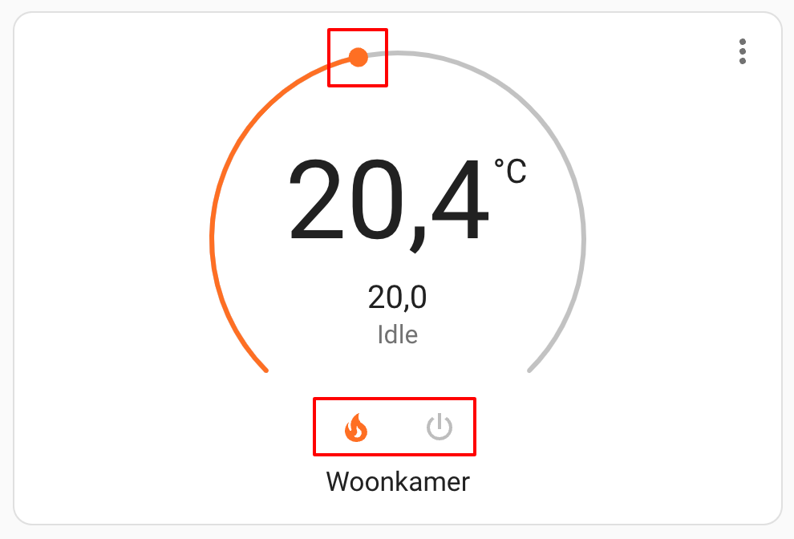

# kiosk-mode complements

Some features are outside `kiosk-mode` scope and they would be hard to maintain and escalate over time, but they could be achieved by alternative methods. This document contains community-driven solutions to achieve things that cannot be done with `kiosk-mode` but could be a complement for Home Assistan instances using this plugin.

### Main UI

`kiosk-mode` is intended to hide elements from the UI to avoid non-authorized users accessing Home Assistant config features specially when it is being shown in a device in kiosk mode. But anything related to change the style of the UI or improve it design falls out of the scope of the plugin. This section contains multiple modifications that could be done in elements of the main UI that are out of the scope of `kiosk-mode`.

#### Move the header to the bottom

This method moves the main Home Assistant header from the top to the bottom of the page. You need to use the [Card Mode Themes] from [card-mod].

```yaml
your-custom-theme:
  card-mod-theme: your-custom-theme
  card-mod-root-yaml: |
    .: | 
      .header {
        bottom: 0;
        top: auto !important;
      }
      #view {
        padding-bottom: calc(var(--header-height) + env(safe-area-inset-top)) !important;
        padding-top: 0 !important;
      }
    ha-tabs$: |
      #selectionBar {
        bottom: auto;
        top: 0;
      }
```

#### Align header tabs to the center

This method aligns the Home Assistant header tabs to the center. You need to use the [Card Mode Themes] from [card-mod].

```yaml
your-custom-theme:
  card-mod-theme: your-custom-theme
  card-mod-root-yaml: |
    ha-tabs$: |
      #tabsContainer {
        display: flex;
        justify-content: center;
      }
```

### Cards

`kiosk-mode` do not modify cards. Mainly because the layout of a lovelace dashboard could have infinite possibilities and it depends on how the user has built it, it is not a fixed layout as the UI of Home Assistant. On top of that, cards change constantly and there are tons of custom-made cards, it will be impossible to maintain and escalate a code that tries to modify whatever card users have in their dashboards. This section contains multiple modifications that you can achieve on cards.


#### Hide more-info button on some native Home Assistant cards

This method uses [card-mod] to hide the `more-info` button located in the top-right corner of some native Home Assistant cards. This button opens a more-info dialog once it is pressed.



```yaml
type: light
entity: light.eetkamer_lamp
card_mod:
  ## Hide more-info button
  style: |
    ha-icon-button.more-info {
      display: none;
    }
```

#### Hide different elements in native climate-entities Home Assistant cards

This method uses [card-mod] to hide different elements inside native climate entities Home Assistant cards.



```yaml
type: thermostat
entity: climate.thermostat
name: Woonkamer
card_mod:
  style:
    ## hide temperature slider
    round-slider$: |
      .slider {
        pointer-events: none;
      }
      .handles {
        display: none
      }
    ## hide buttons
    '#info': |
      #modes {
        display: none;
      }
```

[card-mod]: https://github.com/thomasloven/lovelace-card-mod
[Card Mod Themes]: https://github.com/thomasloven/lovelace-card-mod/wiki/Card-mod-Themes