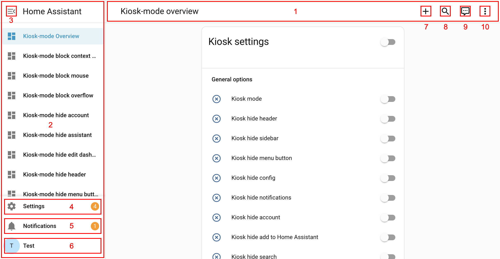
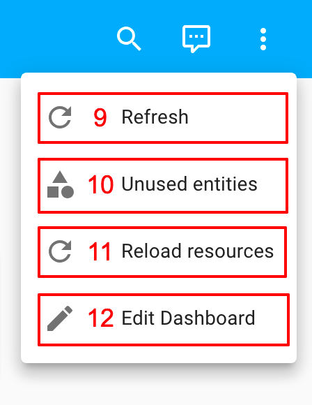
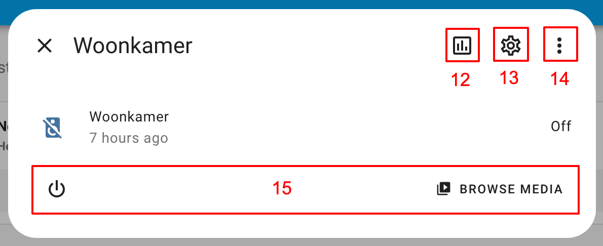
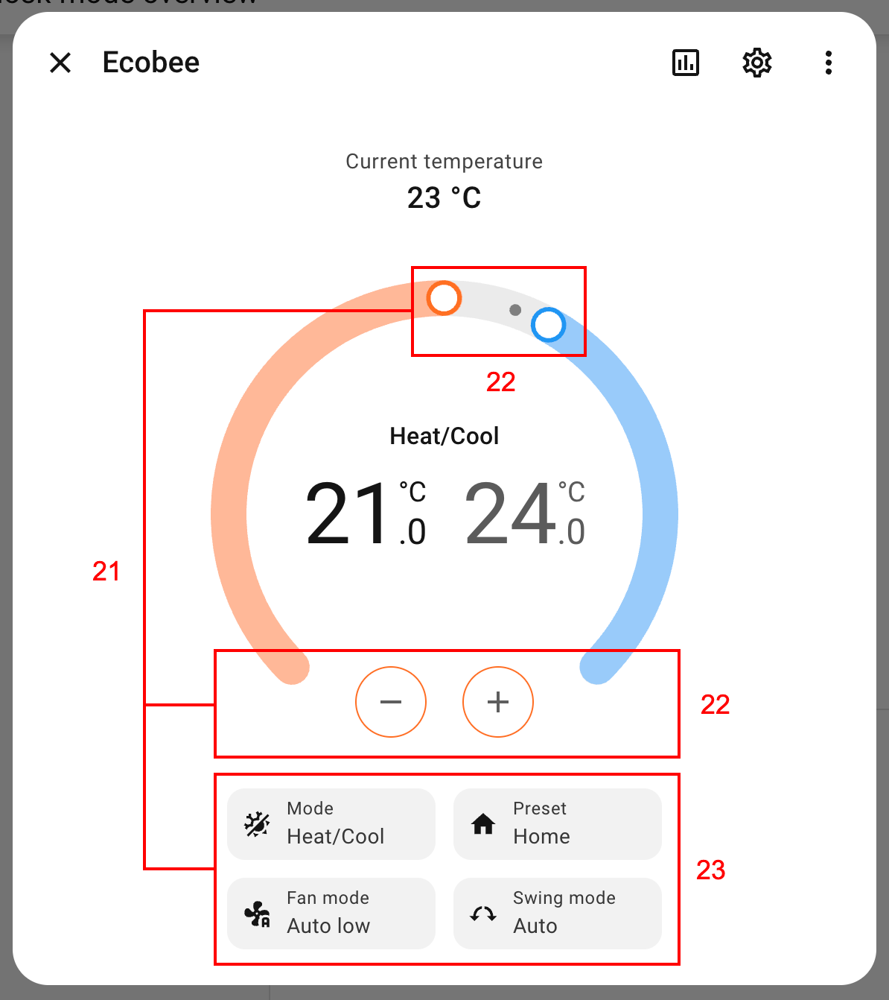
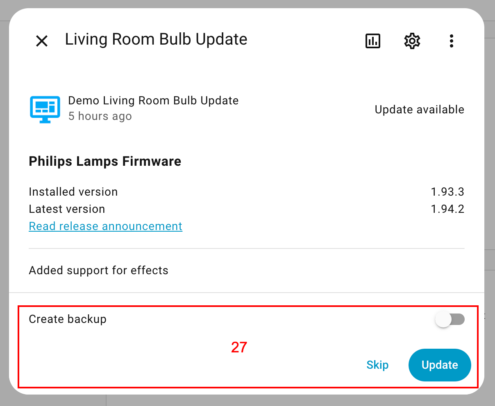
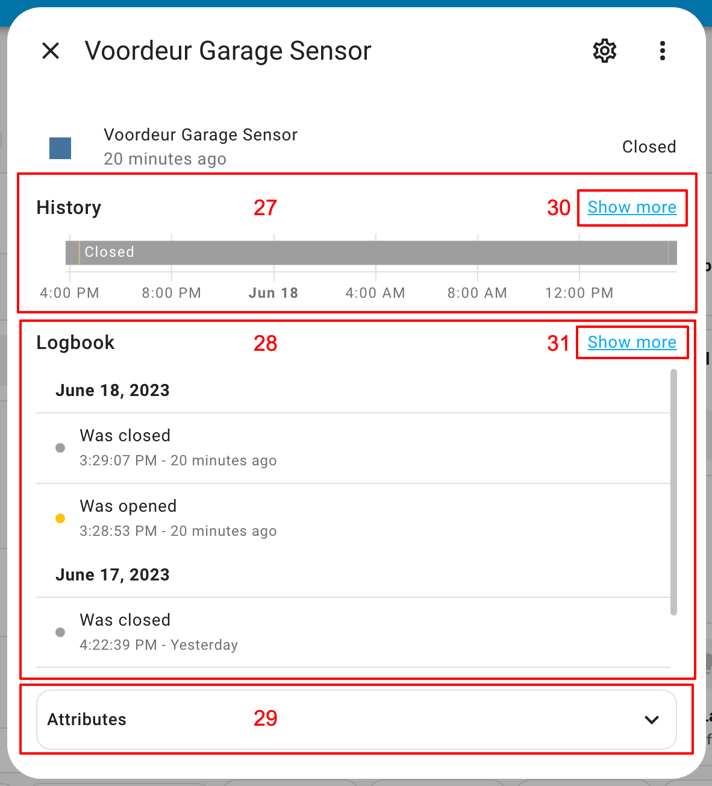

# kiosk-mode
[](https://github.com/hacs/integration)

Hides the header and/or sidebar drawer in [Home Assistant](https://www.home-assistant.io/) lovelace dashboards.


# Installation

**Follow only one of two installation methods below, HACS or Manually:**

>If you want to learn how to install and set some basic configurations in `kiosk-mode` through a video, check the [next one](https://youtu.be/G3lT4zgjER8) from [@smarthomejunkie](https://github.com/smarthomejunkie).

<details>
  <summary><b>Installation and tracking with HACS</b></summary>
<br>

* In the "Frontend" section of [HACS](https://github.com/hacs/integration) hit the plus icon in the bottom right
* Search for `Kiosk Mode` and install it
* If using YAML mode or if HACS doesn't automatically add it you'll need to add the resource below

YAML mode users will add it to their [configuration.yaml](https://www.home-assistant.io/lovelace/dashboards-and-views/#adding-more-dashboards-with-yaml) file.
Non-YAML mode, or Storage Mode, users can find resources in their sidebar under `"Configuration" > "Lovelace Dashboards" > "Resources"`

```yaml
resources:
  - url: /hacsfiles/kiosk-mode/kiosk-mode.js
    type: module
```
<br>
</details>

<details>
  <summary><b>Manual installation</b></summary>
<br>
  
* Download [kiosk-mode.js](https://github.com/NemesisRE/kiosk-mode/releases/latest) from the latest release and place it in your `www` folder
* Add the resource below

YAML mode users add it to their [configuration.yaml](https://www.home-assistant.io/lovelace/dashboards-and-views/#adding-more-dashboards-with-yaml) file.
Non-YAML mode, or Storage Mode, users can find resources in their sidebar under `"Configuration" > "Lovelace Dashboards" > "Resources"`

```yaml
resources:
  # You'll need to update the version number at the end of the url after every update.
  - url: /local/kiosk-mode.js?v=1.2.1
    type: module
```
<br>
</details>

*If you have trouble installing please [read this guide](https://github.com/thomasloven/hass-config/wiki/Lovelace-Plugins)*

## Important Info

* If you need to disable Kiosk-Mode temporarily add `?disable_km` to the end of your URL.
* Config is placed in the root of your Lovelace config: `kiosk_mode:` should not be indented & is per dashboard.
* If you want the same settings on other dashboards you'll need to repeat the config on those dashboards as well.
* Refresh page after config changes.

## Simple config example

YAML mode users need to add the configuration manually to the lovelace dashboard file in which they want to enable `kiosk-mode`. Non-YAML users (Storage Mode) need to add the configuration to each lovelace panel going to `Edit Dashboard` option (located in the overflow menu that appears when one clicks on the top-right three-dots button). Once in `Edit Dashboard` mode, click again on the top-right three-dots button and select `Raw configuration editor`.

```
kiosk_mode:
  hide_header: true
  
views:
```
*Note: `views:` is added in the example above to show where `kiosk_mode:` should be placed in your Lovelace config*<br><br>

## Config Options

| Config Option                            | Type    | Default | Description |
|:-----------------------------------------|:--------|:--------|:------------|
|`kiosk`                                   | Boolean | false   | Hides both the header and sidebar. |
|`hide_header`<sup>1</sup>                 | Boolean | false   | Hides only the header. |
|`hide_sidebar`                            | Boolean | false   | Hides only the sidebar. |
|`hide_menubutton`<sup>1</sup>             | Boolean | false   | Hides only the sidebar menu icon. |
|`hide_notifications`                      | Boolean | false   | Hide the notifications entry-point. |
|`hide_account`                            | Boolean | false   | Hides the account icon. |
|`hide_search`                             | Boolean | false   | Hides the search icon. |
|`hide_assistant`                          | Boolean | false   | Hides the assistant icon. |
|`hide_overflow`                           | Boolean | false   | Hides the top right overflow menu. |
|`block_overflow`                          | Boolean | false   | Blocks the top right overflow menu mouse interactions. |
|`hide_refresh`                            | Boolean | false   | Hides the "Refresh" button inside the top right overflow menu in lovelace yaml mode. |
|`hide_unused_entities`                    | Boolean | false   | Hides the "Unused entities" button inside the top right overflow menu in lovelace yaml mode. |
|`hide_reload_resources`                   | Boolean | false   | Hides the "Reload resources" button inside the top right overflow menu in lovelace yaml mode. |
|`hide_edit_dashboard`                     | Boolean | false   | Hides the "Edit dashboard" button inside the top right overflow menu. |
|`block_mouse`                             | Boolean | false   | Blocks completely the mouse. No interaction is allowed and the mouse will not be visible. **Can only be disabled with `?disable_km` query parameter in the URL.**. |
|`block_context_menu`                      | Boolean | false   | Prevents opening a right-click context menu (sometimes accessible via tap-and-hold on touchscreen devices). |
|`hide_dialog_header_history`              | Boolean | false   | Hides the "History" icon in the header of more-info dialogs. |
|`hide_dialog_header_settings`<sup>2</sup> | Boolean | false   | Hides the "Settings" icon in the header of more-info dialogs. |
|`hide_dialog_header_overflow`<sup>2</sup> | Boolean | false   | Hides the top right overflow menu in the header of more-info dialogs. |
|`hide_dialog_header_action_items`         | Boolean | false   | Hides all the action items from the header of more-info dialogs. |
|`hide_dialog_history`                     | Boolean | false   | Hides the "History" section in the more-info dialogs. |
|`hide_dialog_history_show_more`           | Boolean | false   | Hides the "Show more" link in the "History" section of more-info dialogs.  |
|`hide_dialog_logbook`                     | Boolean | false   | Hides the "Logbook" section in the more-info dialogs. |
|`hide_dialog_logbook_show_more`           | Boolean | false   | Hides the "Show more" link in the "Logbook" section of more-info dialogs. |
|`hide_dialog_attributes`                  | Boolean | false   | Hides the "Attributes" section in the more-info dialogs. |
|`hide_dialog_media_actions`               | Boolean | false   | Hides the actions block in the more-info dialogs of media-player entities. |
|`hide_dialog_update_actions`              | Boolean | false   | Hides the actions block in the more-info dialogs of update entities. |
|`hide_dialog_timer_actions`               | Boolean | false   | Hides the actions block in the more-info dialogs of timer entities. |
|`hide_dialog_climate_actions`             | Boolean | false   | Hides all the actions in the more-info dialogs of climate entities. |
|`hide_dialog_climate_temperature_actions` | Boolean | false   | Hides the temperature cotrol actions in the more-info dialogs of climate entities. |
|`hide_dialog_climate_settings_actions`    | Boolean | false   | Hides the mode and preset actions in the more-info dialogs of climate entities. |
|`ignore_entity_settings`<sup>3</sup>      | Boolean | false   | Useful for [conditional configs](#conditional-lovelace-config) and will cause `entity_settings` to be ignored. |
|`ignore_mobile_settings`<sup>4</sup>      | Boolean | false   | Useful for [conditional configs](#conditional-lovelace-config) and will cause `mobile_settings` to be ignored. |
|`ignore_disable_km`<sup>3</sup>           | Boolean | false   | Useful for [conditional configs](#conditional-lovelace-config) and will cause `disable_km` URL parameter to be ignored. |

<br/>

><sup>1</sup> Take into account that swipe gesture to open the sidebar was removed from Home Assistant in version 2023.4, if you hide the header or the sidebar menu icon, you will not have any way to access the sidebar natively in a browser.
>
><sup>2</sup> These elements are not visible by default if the account is not an admin account.
>
><sup>3</sup> These options only work if they are placed inside [admin_settings](#admin_settings), [non_admin_settings](#non_admin_settings), [user_settings](#user_settings) or [mobile_settings](#mobile_settings). They will not have any effect if they are placed inside [entity_settings](#entity_settings)
>
><sup>4</sup> This option only works if it is placed inside [admin_settings](#admin_settings), [non_admin_settings](#non_admin_settings) or [user_settings](#user_settings). It will not have any effect if it is placed inside [mobile_settings](#mobile_settings) or [entity_settings](#entity_settings)

<br/>

## Options through screenshots
<br>


<br>*Lovelace dashboard*
<br>

| Options              | Hides / Blocks      |
|:---------------------|:--------------------|
| `kiosk`              | 1 and 2             |
| `hide_header`        | 1                   |
| `hide_sidebar`       | 2                   |
| `hide_menubutton`    | 3                   |
| `hide_notifications` | 4                   |
| `hide_account`       | 5                   |
| `hide_search`        | 6                   |
| `hide_assistant`     | 7                   |
| `hide_overflow`      | 8                   |
| `block_overflow`     | 8                   |
| `block_mouse`        | whole interface     |
| `block_context_menu` | right click anywhere|

<br>


<br>*Overflow menu*
<br>

| Options                 | Hides |
|:------------------------|:------|
| `hide_refresh`          | 9     |
| `hide_unused_entities`  | 10    |
| `hide_reload_resources` | 11    |
| `hide_edit_dashboard`   | 12    |

<br>


<br>*More info dialog (media entity)*
<br>

| Options                           | Hides |
|:----------------------------------|:------|
| `hide_dialog_header_action_items` | 13    |
| `hide_dialog_header_history`      | 14    |
| `hide_dialog_header_settings`     | 15    |
| `hide_dialog_header_overflow`     | 16    |
| `hide_dialog_media_actions`       | 17    |
<br>


<br>*More info dialog (climate entity)*
<br>

| Options                                   | Hides |
|:------------------------------------------|:------|
| `hide_dialog_climate_actions`             | 18    |
| `hide_dialog_climate_temperature_actions` | 19    |
| `hide_dialog_climate_settings_actions`    | 20    |
<br>


<br>*More info dialog (update entity / timer entity)*
<br>

| Options                      | Hides |
|:-----------------------------|:------|
| `hide_dialog_update_actions` | 21    |
| `hide_dialog_timer_actions`  | 21    |
<br>


<br>*More info dialog (sensor entity)*
<br>

| Options                         | Hides |
|:--------------------------------|:------|
| `hide_dialog_history`           | 22    |
| `hide_dialog_logbook`           | 23    |
| `hide_dialog_attributes`        | 24    |
| `hide_dialog_history_show_more` | 25    |
| `hide_dialog_logbook_show_more` | 26    |

<br>

## Conditional Lovelace Config
Contitional configs take priority and if a condition matches all other config options/methods are ignored.
These use the same options as above, but placed under one of the following user/entity conditions:<br><br>

### admin_settings:
Sets the config for every admin user.<br>
*Overwritten by user_settings, mobile_settings, and entity_settings ( unless one of the ignore options is used ).*<br>

```
kiosk_mode:
  admin_settings:
    hide_header: true
```
<br>

### non_admin_settings:
Sets the config for every regular user.<br>
*Overwritten by user_settings, mobile_settings, and entity_settings ( unless one of the ignore options is used ).*<br>

```
kiosk_mode:
  non_admin_settings:
    hide_header: true
    ignore_entity_settings: true
```
<br>

### user_settings:
Sets the config for specific users. **This uses a user's name, not their username (if they're different)**.<br>
*Overwritten by mobile_settings, and entity_settings ( unless one of the ignore options is used ).*<br>

```
kiosk_mode:
  user_settings:
    - users:
        - "ryan meek"
        - "maykar"
      hide_sidebar: true
    - users:
        - "the wife"
      kiosk: true
      ignore_entity_settings: true
```
<br>

### mobile_settings:
Sets the config for mobile devices. The default breakpoint is 812px, which can be changed by setting the `custom_width` option.<br>
*Overwritten by entity_settings, unless `ignore_entity_settings` is used, can be ignored with `ignore_mobile_settings`.*<br>

```
kiosk_mode:
  mobile_settings:
    hide_header: true
    ignore_entity_settings: true
    custom_width: 768
```
<br>

### entity_settings:
Dynamically change config on any entity's state. Under `entity:` list the entity followed by the state that will enable the config below. For more complex logic use this with a template sensor.<br>
*Takes priority over all other config settings unless they use `ignore_entity_settings`.*<br><br>

*Any condition that doesn't match will then fall back to previous configurations if another "false" entity condition hasn't also been set (see the 2nd example).*
```
kiosk_mode:
  entity_settings:
    - entity:
        input_boolean.hide_sidebar: 'on'
      hide_sidebar: true
    - entity:
        sensor.hide_header: 'on'
      hide_header: true
    - entity:
        input_text.kiosk: 'true'
      kiosk: true
```

```
kiosk_mode:
  entity_settings:
    # hide_sidebar has both true and false conditions to be a true override.
    - entity:
        input_boolean.hide_sidebar: 'on'
      hide_sidebar: true
    - entity:
        input_boolean.hide_sidebar: 'off'
      hide_sidebar: false
```
<br>

## Query Strings
Add a query string such as `?kiosk` to the end of your URL:

```
https://hass:8123/lovelace/default_view?kiosk
```

The query string options are:

* `?kiosk` to hide both header and sidebar
* `?hide_header` to hide only the header
* `?hide_sidebar` to hide only the sidebar
* `?hide_menubutton` to hide sidebar menu button
* `?hide_notifications` to hide the notifications entry-point
* `?hide_account` to hide the account icon
* `?hide_search` to hide the search icon
* `?hide_assistant` to hide the assistant icon
* `?hide_overflow` to hide the top right menu
* `?block_overflow` to block the top right overflow menu mouse interactions
* `?hide_refresh` to hide the "Refresh" button inside the top right menu in lovelace yaml mode
* `?hide_unused_entities` to hide the "Unused entities" button inside the top right menu in lovelace yaml mode
* `?hide_reload_resources` to hide the "Reload resources" button inside the top right menu in lovelace yaml mode
* `?hide_edit_dashboard` to hide the "Edit dashboard" button inside the top right menu
* `?block_mouse` to block completely the mouse
* `?block_context_menu` to prevent opening a right-click context menu
* `?hide_dialog_header_history` to hide the "History" icon in the header of more-info dialogs
* `?hide_dialog_header_settings` to hide the "Settings" icon in the header of more-info dialogs
* `?hide_dialog_header_overflow` to hide the top right overflow menu in the header of more-info dialogs
* `?hide_dialog_header_action_items` to hide all the action items from the header of more-info dialogs.
* `?hide_dialog_history` to hide the "History" section in the more-info dialogs
* `?hide_dialog_history_show_more` to hide the "Show more" link in the "History" section of more-info dialogs
* `?hide_dialog_logbook` to hide the "Logbook" section in the more-info dialogs
* `?hide_dialog_logbook_show_more` to hide the "Show more" link in the "Logbook" section of more-info dialogs
* `?hide_dialog_attributes` to hide the "Attributes" section in the more-info dialogs
* `?hide_dialog_media_actions` to hide the actions block in the more-info dialogs of media-player entities
* `?hide_dialog_update_actions` to hide the actions block in the more-info dialogs of update entities
* `?hide_dialog_timer_actions` to hide the actions block in the more-info dialogs of timer entities
* `?hide_dialog_climate_actions` to hide all the actions in the more-info dialogs of climate entities
* `?hide_dialog_climate_temperature_actions` to hide the temperature cotrol actions in the more-info dialogs of climate entities
* `?hide_dialog_climate_settings_actions` to hide the mode and preset actions in the more-info dialogs of climate entities


## Query String Caching

You save settings in a devices cache by using the cache keyword once on the device.<br>This will also make it so the options work on all views and dashboards.

Example: `?hide_header&cache` makes all views & dashboards hide the header.<br>
This works for all query strings except for the utility strings listed below.

**Utility Query Strings**

* `?clear_km_cache` will clear all cached preferences
* `?disable_km` will temporarily disable any modifications (unless `ignore_disable_km` has been used in one of the [conditional configs](#conditional-lovelace-config))
<br>

## Kiosk-mode demo

* Make sure you have [git](https://git-scm.com/downloads) installed
* Make sure you have [yarn](https://classic.yarnpkg.com/lang/en/docs/install/#mac-stable) installed
* Make sure you have Docker installed ([Docker Desktop](https://www.docker.com/products/docker-desktop/) is a quick option)
* Clone the repository `git clone https://github.com/NemesisRE/kiosk-mode.git` (or [download it in a zip file](https://docs.github.com/en/repositories/working-with-files/using-files/downloading-source-code-archives))
* Run `Docker Desktop` so you get `docker daemon` running
* Enter in the repository folder
* Run `yarn`
* Run `yarn demo` (`yarn demo:win` on Windows environments)
* Open http://localhost:8123/
* Create an account and complete the onboard

## Kiosk-mode complements

Some features are outside `kiosk-mode` scope and they would be hard to maintain and escalate over time, but they could be achieved by alternative methods. Check [kiosk-mode complements](KIOSK-MODE-COMPLEMENTS.md) for this.

### Related

* [Fully Kiosk Browser](https://www.fully-kiosk.com/) - Great for wall mounted tablets
* [Applicationize](https://applicationize.me/) - Convert web apps into desktop apps
* [KTibow/fullscreen-card](https://github.com/KTibow/fullscreen-card) - Make your Home Assistant browser fullscreen
<br>

### Credit
This was originally based on and inspired by [ciotlosm's kiosk mode gist](https://gist.github.com/ciotlosm/1f09b330aa5bd5ea87b59f33609cc931) and [corrafig's fork](https://gist.github.com/corrafig/c8288df960e7f59e82c12d14de26fde8) of the same gist.

Big thank you to [matt8707](https://github.com/matt8707) for starting this project, allowing me to rewrite it, and transfering ownership.

Many thanks to [KTibow](https://github.com/KTibow) as well, for the github release action and support.

And another big thanks to [maykar](https://github.com/maykar) for the original kiosk mode
